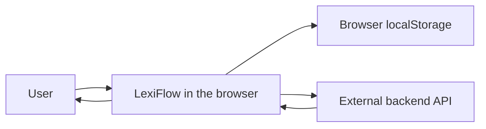
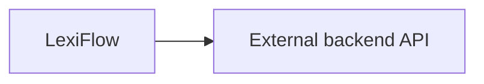

# LexiFlow

LexiFlow is a Blazor WebAssembly client for looking up English words, translating text from a photo, and practicing saved vocabulary.

This repository is only the client. Accounts, dictionary data, photo translation, vocabulary lists, learning collections, notifications, and feedback are handled by a separate backend API. LexiFlow calls that API from the browser. It does not contain the API project.

There is no database in this repository. Some preferences and practice stats stay in the browser. Learning collections and vocabulary lists are stored by the API.

## Getting started

### Prerequisites

- .NET SDK 9. `global.json` requests SDK `9.0.308`. The project targets `net9.0`.
- A current desktop browser. The app runs entirely in the browser after it loads.
- The backend API, running and reachable from the browser.

LexiFlow requires the backend API to be running and accessible. The API is maintained as a separate project. This repository does not include it.

You do not need a local database, User Secrets, or extra environment variables to start LexiFlow. The only launch setting that matters is `ASPNETCORE_ENVIRONMENT=Development`, which the launch profiles already set.

### Configuration

Blazor WebAssembly reads configuration from static files in `wwwroot`. It does not use .NET User Secrets.

| File | When it is used |
| --- | --- |
| `wwwroot/appsettings.json` | Always loaded. This is the file a published build uses. |
| `wwwroot/appsettings.Development.json` | Loaded on top of the base file when the host environment is Development. `dotnet run` uses the launch profiles, which set Development. |

`Program.cs` creates one `HttpClient` for every API call. Its base address is `DictionaryApi:BaseUrl`. If that value is missing, the client falls back to `https://localhost:7130`. Authenticated calls add the stored access token as a `Bearer` header.

#### `DictionaryApi:BaseUrl`

| | |
| --- | --- |
| Purpose | Base URL of the backend API. Every LexiFlow HTTP client uses this value. |
| Required | Yes, unless you want the localhost fallback. |
| Example | `https://localhost:7130` |
| Where to set it | `wwwroot/appsettings.Development.json` for local development. `wwwroot/appsettings.json` for a published build. |

`wwwroot/appsettings.Development.json` already sets this to `https://localhost:7130`. The API you start locally needs to listen on that URL, or you need to change this value to match the API.

#### `AppContact`

Shown on the contact page, privacy page, and footer. Each property is optional. If you omit the section, `AppContactOptions` keeps its built-in defaults.

| Key | Purpose | Example |
| --- | --- | --- |
| `AppContact:DeveloperName` | Name shown in the footer and contact page | `Your Name` |
| `AppContact:Email` | Contact email | `you@example.com` |
| `AppContact:LinkedInUrl` | LinkedIn link | `https://www.linkedin.com/in/your-profile` |
| `AppContact:GitHubUrl` | GitHub link | `https://github.com/your-account` |

#### Keys that are present but unused

`wwwroot/appsettings.json` and `wwwroot/appsettings.Development.json` also contain:

- `AuthApi:BaseUrl`
- `VocabularyListsApi:BaseUrl`

Nothing in this repository reads those keys. Changing them does not move authentication or vocabulary lists to another host. Point `DictionaryApi:BaseUrl` at the API instead.

`Logging` is the usual ASP.NET log-level section. You do not need to change it to run the app.

Local development file:

```json
{
  "DictionaryApi": {
    "BaseUrl": "https://localhost:7130"
  },
  "AppContact": {
    "DeveloperName": "Your Name",
    "Email": "you@example.com",
    "LinkedInUrl": "https://www.linkedin.com/in/your-profile",
    "GitHubUrl": "https://github.com/your-account"
  }
}
```

### Running locally

1. Start the backend API project separately.
2. Make sure its URL matches `DictionaryApi:BaseUrl`. For `dotnet run`, that is the value in `wwwroot/appsettings.Development.json` (`https://localhost:7130` unless you changed it).
3. Start LexiFlow from this repository:

```bash
dotnet run
```

The `http` launch profile serves the app at `http://localhost:5231` and opens a browser.

To use the HTTPS profile instead:

```bash
dotnet run --launch-profile https
```

That profile listens on `https://localhost:7260` and `http://localhost:5231`.

The browser calls the API directly. The API has to accept requests from the LexiFlow origin you opened (`http://localhost:5231` or `https://localhost:7260`). LexiFlow does not proxy those calls.

Sign in or register before using photo translation, favorites, lists, learning, flashcards, quiz, statistics, or profile. Dictionary search works without an account. Saving a word into a learning collection does not, because that write goes to the API with the access token.

## How LexiFlow works



`HttpService` sends JSON requests to the API base URL. It deserializes the response into the models in `Models/`. A non-success response is turned into an error string from `message`, `detail`, `title`, or validation `errors`. A `401` clears the stored session. No current call opts out of that.

The access token, signed-in user, and expiry are kept in `localStorage` by `AuthTokenStore`. `LexiFlowAuthenticationStateProvider` rebuilds the Blazor auth state from that token. Users with `IsAdmin` receive the `Admin` role, which unlocks `/admin/feedback`.

| What stays in the browser | What the API stores |
| --- | --- |
| Favorites (`lexiflow:favorites`) | Accounts and access tokens |
| Profile settings (`lexiflow:settings`) | Dictionary entries and suggestions |
| Practice totals and active days (`lexiflow:learning-activity`) | Photo translation results |
| Recent searches (`lexiflow:recent`) | Vocabulary lists, shares, and list test scores |
| | Learning collections, after the first load |

On the first successful load of learning collections, if the API snapshot is not initialized, `LearningService` uploads either the old `lexiflow:collections` value or a local default set (A2, Work, Travel, Programming, IELTS), then deletes that local key. Later edits go only to the API.

### Main routes

| Route | What it does | Account |
| --- | --- | --- |
| `/` | Search, streak, and shortcuts into practice | Learning stats need a signed-in API call |
| `/dictionary` | Look up a word or phrase | No |
| `/photo-translate` | Translate text in an image | Yes |
| `/favorites` | Words saved in this browser | Yes |
| `/lists`, `/lists/{id}` | Shared vocabulary lists and list tests | Yes |
| `/learning`, `/learning/{id}` | Learning collections | Yes |
| `/flashcards` | Review words from learning collections | Yes |
| `/quiz` | Short multiple-choice quiz from learning words | Yes |
| `/statistics` | Counts derived on the client | Yes |
| `/profile` | Theme, daily goal, pronunciation | Yes |
| `/login`, `/register` | Sign in through the API | No |
| `/contact` | Contact details and a feedback form | Page is public. `POST /api/feedback` attaches the access token when one is stored |
| `/privacy` | Privacy notes | No |
| `/admin/feedback` | Feedback reports | Admin role |

## Dictionary lookup

Search starts in `AppSearchComponent`, on the home page and on `/dictionary`. After two characters, the component waits 280ms and calls `DictionaryApiClient.SearchAsync`.

```text
User types a query
        ↓
AppSearchComponent
        ↓
DictionaryApiClient.SearchAsync
        ↓
GET /api/dictionary/search?query={query}
        ↓
External backend API
        ↓
SearchSuggestion list
        ↓
Suggestion dropdown
```

Choosing a suggestion, pressing Enter, or opening `/dictionary?word=...` calls `DictionaryComponent.Lookup`.

```text
User confirms a word or phrase
        ↓
DictionaryComponent
        ↓
DictionaryApiClient.LookupAsync
        ↓
GET /api/dictionary/lookup?query={query}
        ↓
External backend API
        ↓
DictionaryLookupResult
        ↓
DictionaryEntry kept on the page
        ↓
WordDetailComponent
```

`DictionaryLookupResult` carries the query, a resolved query, an optional `DictionaryEntry`, suggestions, and `IsFound`. When `IsFound` is true, the page keeps `Entry` in component state and renders it. LexiFlow does not cache the entry beyond that page. When it is not found, the page shows `PhraseNotFoundComponent`.

`DictionaryEntry` is the shape LexiFlow expects back: word, pronunciations, meanings, translations, synonyms, antonyms, idioms, phrasal verbs, and collocations. Audio URLs in that payload are played in the browser. The preferred dialect follows the US/UK setting in the profile.

Other dictionary calls from this client:

| Call | Client method | Used when |
| --- | --- | --- |
| `GET /api/dictionary/{word}` | `GetWordAsync` | A vocabulary-list or photo-review screen loads one headword. Spaces in the word are joined with hyphens before the request. |
| `POST /api/dictionary/suggestion` | `GetSuggestionAsync` | Photo Translate resolves an alternative suggestion into an entry. |

From a dictionary result, `WordDetailComponent` can save the entry to favorites in `localStorage`, or add it to a learning collection through `LearningService`. Adding to learning needs a signed-in session. If there is no default collection, the UI asks you to pick one.

LexiFlow stops at the HTTP response. How the API finds or parses dictionary data is outside this repository.

## Photo Translate

Photo Translate is `/photo-translate`. The page requires a signed-in user because both photo endpoints send the access token.

The page has two modes, `Text` and `WordList`. Switching mode clears the current result.

```text
Image selected or dropped
        ↓
PhotoTranslateComponent checks type and size
        ↓
PhotoTranslationApiClient.TranslateAsync
        ↓
POST /api/photo-translate
        ↓
External backend API
        ↓
PhotoTranslationResult
        ↓
Text view, or a word list to review
        ↓
Optional dictionary lookup, favorites, learning collection, or vocabulary list
```

LexiFlow accepts JPG, JPEG, PNG, and WebP files up to 10 MB. It reads the file in the browser and uploads it as multipart form data: the file field is `image`, and `mode` is `Text` or `WordList`. Recognition and translation happen in the API. The client only stores the returned `PhotoTranslationResult`: `OriginalText`, `TranslatedText`, per-word `Words`, and an optional `TranslationError`.

If translation is missing, **Retry** sends the recognized text back without the image:

```text
POST /api/photo-translate/text
{ "text": "<original text>", "mode": "Text" | "WordList" }
```

**Text mode.** The client splits `OriginalText` into words with a local regular expression. You can select a word or a short phrase. That selection calls `DictionaryApiClient.LookupAsync` (`GET /api/dictionary/lookup`). The entry can be saved to favorites, added to a learning collection, or added to one of your vocabulary lists (`POST /api/lists/{id}/words`).

**Word list mode.** `Words` from the API become review rows. You can edit a row, search the dictionary for a replacement (`GET /api/dictionary/search` and `GET /api/dictionary/{word}`), or remove a row. Confirming the import calls `LearningService.AddWordsAsync`, which writes the chosen learning collection through `PUT /api/learning-collections`. Duplicates in that collection are skipped.

## Learning

LexiFlow has two different places to keep words.

**Learning collections** (`/learning`) are what flashcards and the quiz use. A collection has a name, a color, a default flag, and a list of `LearningWord` items. One collection is the default used by “Add to learning”. `LearningService` loads and saves the full set through `/api/learning-collections`.

A learning word stores the headword, CEFR level, the first definition, the first translation, review counts, and timestamps. It does not store the full dictionary entry. New words start in the `New` state.

**Vocabulary lists** (`/lists`) are separate and live only on the API through `VocabularyListsApiClient`. You can create, rename, archive, restore, and delete lists, add or remove words, and share a list with another user (`GET /api/users/search`, then `POST /api/lists/{id}/share`). Adding a word from a list can look that word up in the dictionary first. Lists are not the source for `/flashcards` or `/quiz`.

**Favorites** are a third copy, stored only in this browser. They are not uploaded with learning collections.

### Review

`/flashcards` loads every learning word, or one collection when `collectionId` is in the query string. **To learn** hides words already marked `Mastered`. **All words** shows the full set.

Each card has three actions:

| Button | Stored state | Counter |
| --- | --- | --- |
| Again | `New` | `AgainCount` |
| Learning | `Learning` | `HardCount` |
| Learned | `Mastered` | `EasyCount` |

`LearningService.UpdateWordAsync` writes the new state and `LastReviewedAt`, then saves the collections to the API. The time spent on the card is added to local practice stats. There is no interval or spaced-repetition schedule in this client. `LearningState.Review` is recognized if a word already has it, but the flashcard buttons do not set it.

`/quiz` builds up to eight questions from learning words that have a translation or a definition. The answer is the translation when one exists, otherwise the definition. The other choices are shuffled values from the same small pool. Finishing records correct and total answers in `localStorage`. The quiz does not change a word’s learning state and does not call the list-test endpoint.

A vocabulary list has its own test on the list page. Questions alternate between a multiple-choice translation and typing the English word for a translation. The score is posted to `POST /api/lists/{id}/test-results` and also recorded in the local practice totals.

### Progress

`StatisticsService` calculates the statistics page and the home metrics in the browser:

- learned words: distinct headwords across learning collections
- mastered words: those with at least one `Mastered` copy
- daily progress: distinct words added today, compared with the daily goal
- streak: consecutive local days that have a review, an added word, or other recorded practice, counting today or yesterday as the start
- accuracy and study time: from `lexiflow:learning-activity`
- favorites: the local favorites list

The daily goal, dark theme, default pronunciation (`US` or `UK`), and auto-play live in `lexiflow:settings`. The profile slider allows a goal from 1 to 50. The default is 12. `UserSettingsService` resets a stored goal outside 1–100 back to 12.

`StatisticsChangeNotifier` tells the home page to reload after favorites, learning collections, or practice stats change.

## Architecture

LexiFlow is a single Blazor WebAssembly project, `LexiFlow.csproj`. `Program.cs` registers MudBlazor, authorization, one `HttpClient`, and the scoped services. UI lives in `Components`. API access lives in `Services/*ApiClient`. Client-only behavior lives in `Services/Favorites`, `Services/Learning`, `Services/LearningActivity`, `Services/Statistics`, and `Services/UserSettings`.

```text
LexiFlow/
├── Components/          pages, layout, and shared UI
├── Configuration/       options bound from appsettings
├── Enums/
├── Models/              response and request shapes
├── Services/            HTTP clients and client-side services
├── Validators/
├── wwwroot/             static host, CSS, JS, appsettings
└── Program.cs
```



There is one external service. Dictionary, auth, photo translation, vocabulary lists, learning collections, notifications, and feedback are all called on `DictionaryApi:BaseUrl`.

`wwwroot/lexiflow.js` is the small browser helper for `localStorage`, audio playback, the photo drop zone, and the list-test “leave page” warning. It is not a second backend.

## Tech stack

Taken from this repository:

- C# and Blazor WebAssembly on .NET 9 (`Microsoft.AspNetCore.Components.WebAssembly` 9.0.8)
- MudBlazor 9.6.0
- FluentValidation 12.1.1
- `System.Net.Http.Json` and `Microsoft.Extensions.Http` for API calls
- Browser `localStorage` through JS interop

HTML parsing, OCR, and dictionary providers are not part of this project.

## External dependencies

### Backend API

LexiFlow uses it for:

- registration, login, and logout
- dictionary search, lookup, and single-word fetch
- photo and text translation
- vocabulary lists, sharing, and list test scores
- learning collections
- notifications
- feedback submitted from the contact page, and the admin feedback list

Connection: the browser `HttpClient` in `Program.cs`, used by `HttpService` and the clients under `Services`.

Configuration: `DictionaryApi:BaseUrl`.

Calls that require the access token are marked `RequiresAuthentication` on `ApiRequestOptions`. Dictionary search and lookup are sent without a token. Photo translation, lists, learning collections, notifications, feedback, and logout are not.

| Area | Requests LexiFlow sends |
| --- | --- |
| Auth | `POST /api/auth/register`, `POST /api/auth/login`, `POST /api/auth/logout` |
| Dictionary | `GET /api/dictionary/search`, `GET /api/dictionary/lookup`, `GET /api/dictionary/{word}`, `POST /api/dictionary/suggestion` |
| Photo | `POST /api/photo-translate`, `POST /api/photo-translate/text` |
| Vocabulary lists | `GET/POST /api/lists`, `GET /api/lists?archived=true`, `GET /api/shared-lists`, `GET/PUT/DELETE /api/lists/{id}`, `POST /api/lists/{id}/words`, `DELETE /api/lists/{id}/words/{wordId}`, `POST /api/lists/{id}/share`, `DELETE /api/lists/{id}/share/{userId}`, `POST /api/lists/{id}/archive`, `POST /api/lists/{id}/restore`, `POST /api/lists/{id}/test-results`, `GET /api/users/search` |
| Learning | `GET` and `PUT /api/learning-collections`, `DELETE /api/learning-collections/{id}` |
| Notifications | `GET /api/notifications`, `POST /api/notifications/{id}/read` |
| Feedback | `POST /api/feedback`, `GET /api/feedback/admin`, `PATCH /api/feedback/admin/{id}/status` |

The contact page and privacy page describe what the API does with images and dictionary content. That behavior is implemented in the API project, not here.

## Project structure

```text
LexiFlow/
├── Components/
│   ├── Layout/                 shell, nav, theme
│   ├── Pages/
│   │   ├── Auth/
│   │   ├── Collections/        vocabulary lists and learning collections
│   │   ├── Dictionary/
│   │   ├── Feedback/
│   │   ├── Learning/           flashcards and quiz
│   │   ├── PhotoTranslate/
│   │   └── Profile/            favorites, statistics, settings
│   └── Shared/                 search, word detail, dialogs
├── Configuration/              AppContactOptions, per-request HTTP options
├── Models/                     dictionary, learning, vocabulary, auth, photo
├── Services/
│   ├── *ApiClient/             one client per API area, all sharing HttpService
│   ├── Authentication/         login, register, logout
│   ├── AuthTokenStore/        token in localStorage
│   ├── Http/                   JSON send, errors, bearer token
│   ├── Learning/               collection rules and word state
│   ├── Favorites/              local favorites
│   ├── Statistics/             client-side stats
│   └── UserSettings/           local profile settings
├── wwwroot/
│   ├── appsettings.json
│   ├── appsettings.Development.json
│   ├── index.html
│   └── lexiflow.js
├── Program.cs
├── LexiFlow.csproj
└── global.json
```

`Components/Pages/PhotoTranslate` is split across partial classes: the page state, image upload, text selection, and the word-list review. `Components/Pages/Collections/VocabularyListDetailComponent` is split the same way for words, sharing, and the list test.

Start with `Program.cs` for registration, `Services/Http/HttpService.cs` for how requests are sent, and `Services/DictionaryApiClient` or `Services/PhotoTranslationApiClient` for a single feature’s HTTP boundary.
